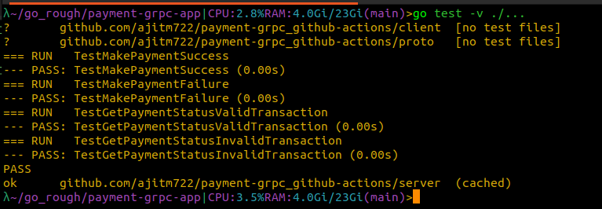

# Payment gRPC App

This project is a Go-based application that demonstrates the use of gRPC for building a payment service. It includes both server and client implementations, along with Protocol Buffers for defining the service interface.

## Features

- gRPC-based communication between client and server.
- Protocol Buffers for efficient serialization.
- Modular design with separate server and client components.
- Automated CI workflow using GitHub Actions.

## Prerequisites

Before you begin, ensure you have the following installed:

- [Go](https://golang.org/doc/install) (version 1.23.0 or higher)
- [Protocol Buffers Compiler](https://grpc.io/docs/protoc-installation/)
- Git

## Setup Instructions

1. Clone the repository:

   ```bash
   git clone https://github.com/your-username/payment-grpc-app.git
   cd payment-grpc-app
   ```

2. Install dependencies:

   ```bash
   go mod tidy
   ```

3. Install Protocol Buffers plugins for Go:

   ```bash
   go install google.golang.org/protobuf/cmd/protoc-gen-go@v1.36
   go install google.golang.org/grpc/cmd/protoc-gen-go-grpc@v1.3
   ```

4. Ensure the Go binary directory is in your PATH:

   ```bash
   export PATH=$PATH:$(go env GOPATH)/bin
   ```

## Build Instructions

1. Generate Go code from the `.proto` file:

   ```bash
   protoc --go_out=. --go-grpc_out=. proto/payment.proto
   ```

2. Create a `bin` directory for executables:

   ```bash
   mkdir -p bin
   ```

3. Build the server:

   ```bash
   go build -o bin/server ./server
   ```

4. Build the client:

   ```bash
   go build -o bin/client ./client
   ```

## Testing Instructions

Run tests for the server:

```bash
go test -v -count=1 ./server/...
```

## CI Workflow

This project includes a GitHub Actions workflow for continuous integration. The workflow performs the following steps:

- Checks out the code.
- Sets up the Go environment.
- Installs the Protocol Buffers compiler and Go plugins.
- Generates Go code from the `.proto` file.
- Tidies Go modules.
- Builds the server and client binaries.
- Runs tests for the server.

## Reference Output 1 - Server and Client


## Reference Output 2 - Server Functionality Tests


